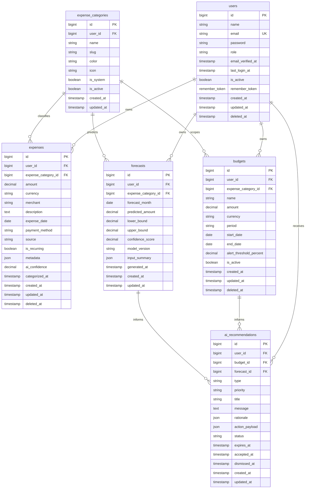

# FinSight AI Database Schema

## 1. Database Overview

FinSight AI uses MySQL as the primary relational database. The Laravel backend owns all direct database access. The frontend and AI service must never connect to MySQL directly.

Core entities:

- `users`
- `expense_categories`
- `expenses`
- `budgets`
- `forecasts`
- `ai_recommendations`

Supporting authentication fields are included in `users`, while refresh-token storage can be added as a separate table during implementation if the selected JWT package requires server-side token tracking.

## 2. Entity Relationship Diagram

## 3. Table Specifications

### users

Stores platform accounts and authorization metadata.

| Column | Type | Constraints | Notes |
| --- | --- | --- | --- |
| `id` | `BIGINT UNSIGNED` | PK, auto increment | Primary identifier. |
| `name` | `VARCHAR(255)` | Not null | Display name. |
| `email` | `VARCHAR(255)` | Not null, unique | Login identifier. |
| `password` | `VARCHAR(255)` | Not null | Hashed password only. |
| `role` | `VARCHAR(50)` | Not null, default `user` | Enables future role expansion. |
| `email_verified_at` | `TIMESTAMP` | Nullable | Laravel-compatible verification. |
| `last_login_at` | `TIMESTAMP` | Nullable | Useful for security and analytics. |
| `is_active` | `BOOLEAN` | Not null, default `true` | Soft account access control. |
| `remember_token` | `VARCHAR(100)` | Nullable | Laravel compatibility. |
| `created_at` | `TIMESTAMP` | Not null | Laravel timestamp. |
| `updated_at` | `TIMESTAMP` | Not null | Laravel timestamp. |
| `deleted_at` | `TIMESTAMP` | Nullable | Soft delete support. |

Indexes:

- Unique index on `email`.
- Index on `role`.
- Index on `is_active`.

### expense_categories

Stores system and user-defined expense categories.

| Column | Type | Constraints | Notes |
| --- | --- | --- | --- |
| `id` | `BIGINT UNSIGNED` | PK, auto increment | Primary identifier. |
| `user_id` | `BIGINT UNSIGNED` | Nullable, FK `users.id` | Null for global system categories. |
| `name` | `VARCHAR(120)` | Not null | Human-readable category name. |
| `slug` | `VARCHAR(140)` | Not null | Stable API-friendly identifier. |
| `color` | `VARCHAR(20)` | Nullable | UI color token or hex value. |
| `icon` | `VARCHAR(80)` | Nullable | UI icon identifier. |
| `is_system` | `BOOLEAN` | Not null, default `false` | Distinguishes default categories. |
| `is_active` | `BOOLEAN` | Not null, default `true` | Allows hiding categories. |
| `created_at` | `TIMESTAMP` | Not null | Laravel timestamp. |
| `updated_at` | `TIMESTAMP` | Not null | Laravel timestamp. |

Indexes:

- Composite unique index on `user_id`, `slug`.
- Index on `is_system`.
- Index on `is_active`.

### expenses

Stores individual user expense records.

| Column | Type | Constraints | Notes |
| --- | --- | --- | --- |
| `id` | `BIGINT UNSIGNED` | PK, auto increment | Primary identifier. |
| `user_id` | `BIGINT UNSIGNED` | Not null, FK `users.id` | Owner. |
| `expense_category_id` | `BIGINT UNSIGNED` | Nullable, FK `expense_categories.id` | Nullable before categorization. |
| `amount` | `DECIMAL(12,2)` | Not null | Positive expense amount. |
| `currency` | `CHAR(3)` | Not null, default `USD` | ISO 4217 currency code. |
| `merchant` | `VARCHAR(255)` | Nullable | Merchant or payee. |
| `description` | `TEXT` | Nullable | User-entered or imported description. |
| `expense_date` | `DATE` | Not null | Financial transaction date. |
| `payment_method` | `VARCHAR(80)` | Nullable | Cash, card, wallet, bank transfer. |
| `source` | `VARCHAR(50)` | Not null, default `manual` | `manual`, `import`, `api`, future bank sync. |
| `is_recurring` | `BOOLEAN` | Not null, default `false` | Recurrence signal. |
| `metadata` | `JSON` | Nullable | Import details, tags, raw fields. |
| `ai_confidence` | `DECIMAL(5,4)` | Nullable | Category prediction confidence. |
| `categorized_at` | `TIMESTAMP` | Nullable | AI or manual categorization time. |
| `created_at` | `TIMESTAMP` | Not null | Laravel timestamp. |
| `updated_at` | `TIMESTAMP` | Not null | Laravel timestamp. |
| `deleted_at` | `TIMESTAMP` | Nullable | Soft delete support. |

Indexes:

- Composite index on `user_id`, `expense_date`.
- Composite index on `user_id`, `expense_category_id`.
- Index on `source`.
- Index on `is_recurring`.

### budgets

Stores category-specific or overall spending limits.

| Column | Type | Constraints | Notes |
| --- | --- | --- | --- |
| `id` | `BIGINT UNSIGNED` | PK, auto increment | Primary identifier. |
| `user_id` | `BIGINT UNSIGNED` | Not null, FK `users.id` | Owner. |
| `expense_category_id` | `BIGINT UNSIGNED` | Nullable, FK `expense_categories.id` | Null means overall budget. |
| `name` | `VARCHAR(160)` | Not null | Budget label. |
| `amount` | `DECIMAL(12,2)` | Not null | Budget cap. |
| `currency` | `CHAR(3)` | Not null, default `USD` | ISO 4217 currency code. |
| `period` | `VARCHAR(30)` | Not null | `weekly`, `monthly`, `quarterly`, `yearly`. |
| `start_date` | `DATE` | Not null | Budget start. |
| `end_date` | `DATE` | Nullable | Null for repeating active budget. |
| `alert_threshold_percent` | `DECIMAL(5,2)` | Not null, default `80.00` | Alert threshold. |
| `is_active` | `BOOLEAN` | Not null, default `true` | Active budget flag. |
| `created_at` | `TIMESTAMP` | Not null | Laravel timestamp. |
| `updated_at` | `TIMESTAMP` | Not null | Laravel timestamp. |
| `deleted_at` | `TIMESTAMP` | Nullable | Soft delete support. |

Indexes:

- Composite index on `user_id`, `period`, `is_active`.
- Composite index on `user_id`, `expense_category_id`.
- Index on `start_date`.

### forecasts

Stores monthly forecast outputs from the AI service.

| Column | Type | Constraints | Notes |
| --- | --- | --- | --- |
| `id` | `BIGINT UNSIGNED` | PK, auto increment | Primary identifier. |
| `user_id` | `BIGINT UNSIGNED` | Not null, FK `users.id` | Owner. |
| `expense_category_id` | `BIGINT UNSIGNED` | Nullable, FK `expense_categories.id` | Null means total monthly forecast. |
| `forecast_month` | `DATE` | Not null | Use first day of target month. |
| `predicted_amount` | `DECIMAL(12,2)` | Not null | Forecasted spend. |
| `lower_bound` | `DECIMAL(12,2)` | Nullable | Confidence interval lower bound. |
| `upper_bound` | `DECIMAL(12,2)` | Nullable | Confidence interval upper bound. |
| `confidence_score` | `DECIMAL(5,4)` | Nullable | Model confidence. |
| `model_version` | `VARCHAR(80)` | Not null | AI model or ruleset version. |
| `input_summary` | `JSON` | Nullable | Sanitized feature summary. |
| `generated_at` | `TIMESTAMP` | Not null | Forecast generation time. |
| `created_at` | `TIMESTAMP` | Not null | Laravel timestamp. |
| `updated_at` | `TIMESTAMP` | Not null | Laravel timestamp. |

Indexes:

- Composite unique index on `user_id`, `expense_category_id`, `forecast_month`, `model_version`.
- Composite index on `user_id`, `forecast_month`.

### ai_recommendations

Stores generated budgeting and spending recommendations.

| Column | Type | Constraints | Notes |
| --- | --- | --- | --- |
| `id` | `BIGINT UNSIGNED` | PK, auto increment | Primary identifier. |
| `user_id` | `BIGINT UNSIGNED` | Not null, FK `users.id` | Recipient. |
| `budget_id` | `BIGINT UNSIGNED` | Nullable, FK `budgets.id` | Related budget when relevant. |
| `forecast_id` | `BIGINT UNSIGNED` | Nullable, FK `forecasts.id` | Related forecast when relevant. |
| `type` | `VARCHAR(80)` | Not null | `budget_adjustment`, `spending_alert`, `savings_opportunity`, `category_insight`. |
| `priority` | `VARCHAR(30)` | Not null, default `medium` | `low`, `medium`, `high`, `critical`. |
| `title` | `VARCHAR(180)` | Not null | Short recommendation title. |
| `message` | `TEXT` | Not null | User-facing recommendation body. |
| `rationale` | `JSON` | Nullable | Explanation data and model signals. |
| `action_payload` | `JSON` | Nullable | Suggested action data. |
| `status` | `VARCHAR(30)` | Not null, default `new` | `new`, `viewed`, `accepted`, `dismissed`, `expired`. |
| `expires_at` | `TIMESTAMP` | Nullable | Recommendation expiration. |
| `accepted_at` | `TIMESTAMP` | Nullable | Accepted timestamp. |
| `dismissed_at` | `TIMESTAMP` | Nullable | Dismissed timestamp. |
| `created_at` | `TIMESTAMP` | Not null | Laravel timestamp. |
| `updated_at` | `TIMESTAMP` | Not null | Laravel timestamp. |

Indexes:

- Composite index on `user_id`, `status`, `priority`.
- Composite index on `user_id`, `type`.
- Index on `expires_at`.

## 4. Relationship Rules

- `users` own all personal financial data.
- `expense_categories.user_id` is nullable to support global system categories.
- `expenses.expense_category_id` is nullable to support uncategorized expenses.
- `budgets.expense_category_id` is nullable to support overall budgets.
- `forecasts.expense_category_id` is nullable to support overall forecasts.
- `ai_recommendations` can reference a budget, a forecast, both, or neither depending on recommendation type.
- User-owned data should use soft deletes where losing history could harm analytics.

## 5. Data Integrity Rules

- Expense amounts and budget amounts must be greater than zero.
- Currency values should use uppercase ISO 4217 codes.
- `forecast_month` should always be normalized to the first day of the month.
- `confidence_score` and `ai_confidence` should be between `0.0000` and `1.0000`.
- A user cannot access another user's financial records even if they know an ID.
- Deleting a user should trigger a deliberate data-retention workflow, not accidental cascading deletion in production.

## 6. Future Tables

Likely future additions:

- `refresh_tokens` for token rotation and revocation.
- `roles` and `permissions` if role logic outgrows a simple user role column.
- `expense_imports` for CSV or bank-import audit trails.
- `recurring_expenses` for explicit recurrence rules.
- `notifications` for alerts and recommendation delivery.
- `model_runs` for AI training and inference observability.
- `audit_logs` for security-sensitive changes.
