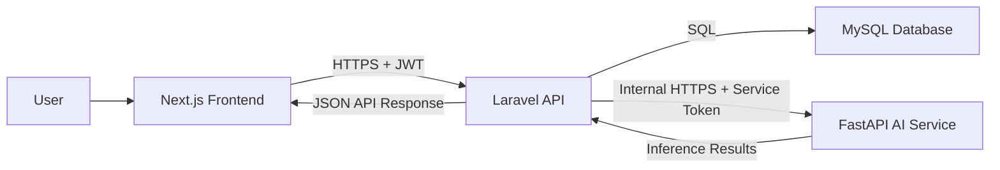
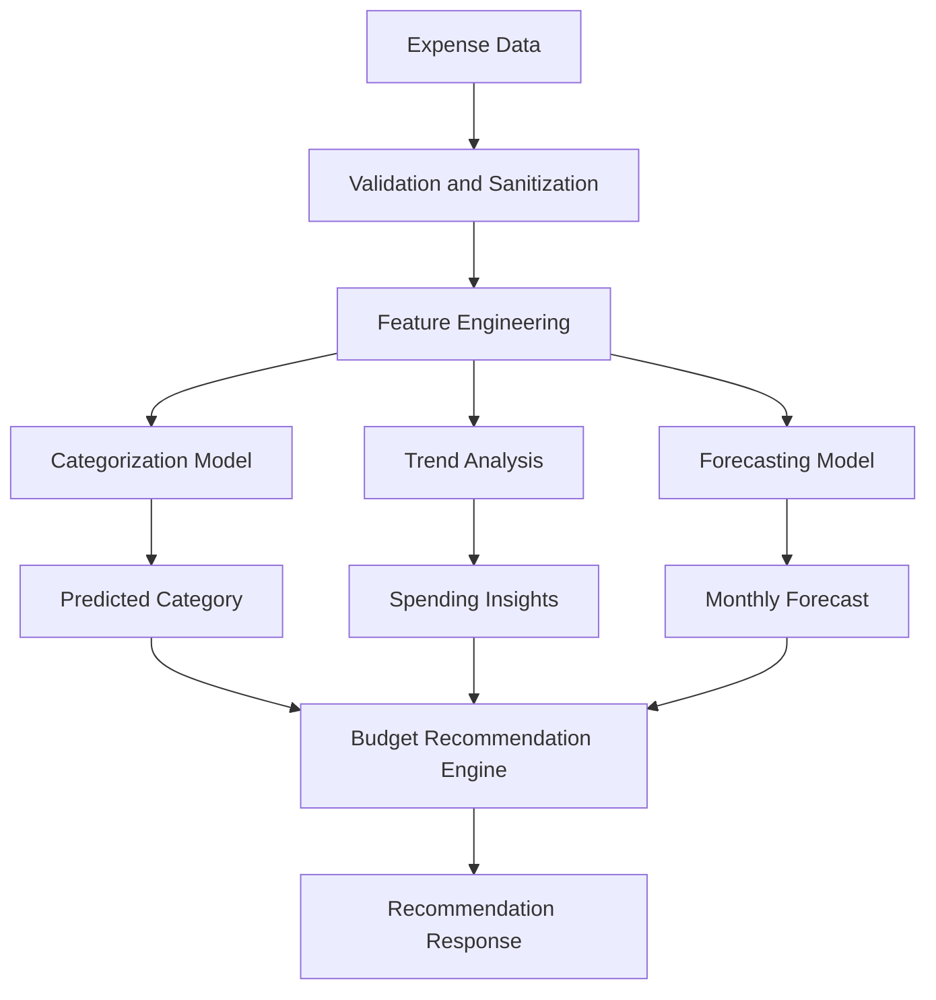

# FinSight AI System Architecture

## 1. Architecture Overview

FinSight AI is a production-grade, service-oriented personal finance platform that helps users track expenses, analyze spending behavior, forecast future expenses, and receive AI-powered budgeting recommendations.

The platform is organized as three independent services:

```text
finsight-ai/
├── frontend/       # Next.js, TypeScript, Tailwind CSS
├── backend/        # Laravel 12 REST API, JWT auth, MySQL
├── ai-service/     # FastAPI, Scikit-Learn, model inference and training
├── docs/           # Architecture and planning artifacts
├── SYSTEM_ARCHITECTURE.md
├── DATABASE_SCHEMA.md
├── API_SPECIFICATION.md
└── DEVELOPMENT_ROADMAP.md
```

## 2. Service Responsibilities

### Frontend: Next.js

The frontend is responsible for all user-facing experiences.

Planned responsibilities:

- Authentication screens and session handling.
- Expense entry, editing, filtering, and categorization UI.
- Budget creation and monitoring workflows.
- Dashboard charts and financial summaries.
- Forecast and recommendation views.
- Role-aware navigation for future admin or advisor capabilities.

Recommended structure:

```text
frontend/
├── app/
│   ├── (auth)/
│   │   ├── login/
│   │   └── register/
│   ├── (dashboard)/
│   │   ├── dashboard/
│   │   ├── expenses/
│   │   ├── budgets/
│   │   ├── forecasts/
│   │   └── recommendations/
│   ├── api/
│   ├── layout.tsx
│   └── page.tsx
├── components/
│   ├── charts/
│   ├── forms/
│   ├── layout/
│   └── ui/
├── config/
├── features/
│   ├── auth/
│   ├── budgets/
│   ├── dashboard/
│   ├── expenses/
│   ├── forecasts/
│   └── recommendations/
├── hooks/
├── lib/
│   ├── api-client.ts
│   ├── auth.ts
│   └── validators.ts
├── providers/
├── styles/
├── types/
├── middleware.ts
├── next.config.ts
├── package.json
├── tailwind.config.ts
└── tsconfig.json
```

### Backend API: Laravel 12

The backend is the system of record and the public REST API consumed by the frontend.

Planned responsibilities:

- JWT authentication and token lifecycle.
- User, role, and authorization policies.
- Expense, category, budget, forecast, and recommendation persistence.
- Dashboard aggregation queries.
- Communication with the AI service.
- Request validation, rate limiting, audit logging, and API versioning.

Recommended structure:

```text
backend/
├── app/
│   ├── Actions/
│   ├── DTOs/
│   ├── Enums/
│   ├── Exceptions/
│   ├── Http/
│   │   ├── Controllers/
│   │   │   └── Api/
│   │   │       └── V1/
│   │   ├── Middleware/
│   │   ├── Requests/
│   │   └── Resources/
│   ├── Jobs/
│   ├── Models/
│   ├── Policies/
│   ├── Providers/
│   ├── Services/
│   │   ├── Ai/
│   │   ├── Auth/
│   │   ├── Budgeting/
│   │   ├── Dashboard/
│   │   └── Expenses/
│   └── Support/
├── bootstrap/
├── config/
├── database/
│   ├── factories/
│   ├── migrations/
│   └── seeders/
├── routes/
│   ├── api.php
│   └── console.php
├── storage/
├── tests/
│   ├── Feature/
│   └── Unit/
├── composer.json
└── phpunit.xml
```

### AI Service: FastAPI

The AI service owns model training, model inference, and finance intelligence workflows.

Planned responsibilities:

- Automatic expense categorization.
- Spending trend analysis.
- Monthly expense forecasting.
- Budget recommendation generation.
- Model versioning and evaluation reports.
- Stateless API endpoints for backend-triggered inference.

Recommended structure:

```text
ai-service/
├── app/
│   ├── api/
│   │   └── v1/
│   │       ├── categorization.py
│   │       ├── forecasting.py
│   │       ├── health.py
│   │       ├── recommendations.py
│   │       └── trends.py
│   ├── core/
│   │   ├── config.py
│   │   ├── logging.py
│   │   └── security.py
│   ├── data/
│   │   ├── preprocessing.py
│   │   └── schemas.py
│   ├── models/
│   │   ├── categorizer.py
│   │   ├── forecaster.py
│   │   └── recommender.py
│   ├── pipelines/
│   │   ├── categorization_pipeline.py
│   │   ├── forecasting_pipeline.py
│   │   └── recommendation_pipeline.py
│   ├── services/
│   ├── main.py
│   └── dependencies.py
├── notebooks/
├── tests/
├── model_artifacts/
│   └── .gitkeep
├── pyproject.toml
└── README.md
```

## 3. High-Level Request Flow



## 4. Deployment Topology

Recommended production deployment:

- Frontend hosted as a Next.js web application behind a CDN.
- Backend Laravel API deployed behind an API gateway or load balancer.
- AI service deployed as an internal service that is not publicly reachable.
- MySQL deployed as a managed database with automated backups.
- Redis added later for queues, cache, rate limiting, and async AI jobs.
- Object storage added later for model artifacts and exports.

## 5. Communication Contracts

### Frontend to Backend

- Protocol: HTTPS.
- Format: JSON.
- Authentication: JWT access token in `Authorization: Bearer <token>`.
- Token refresh: secure refresh token flow.
- Versioning: `/api/v1`.

### Backend to AI Service

- Protocol: private network HTTPS.
- Format: JSON.
- Authentication: service-to-service API token or signed request header.
- Timeout policy: strict timeouts with retries only for idempotent operations.
- Reliability: long-running training or batch forecasting should move to queues in later phases.

## 6. Authentication Architecture

FinSight AI uses JWT authentication managed by the Laravel backend.

Core principles:

- Passwords are hashed using Laravel's default secure hashing configuration.
- Access tokens are short-lived.
- Refresh tokens are long-lived, revocable, rotated, and stored securely.
- Frontend stores access tokens in memory when possible.
- Refresh tokens should be stored in secure, HTTP-only cookies for browser clients.
- All authenticated endpoints require `Authorization: Bearer <access_token>`.
- Role support is included from the start for future expansion.

Initial roles:

| Role | Purpose |
| --- | --- |
| `user` | Default personal finance user. |
| `admin` | Future administrative support and moderation. |
| `advisor` | Future human or institutional advisor workflows. |

## 7. Authorization Model

Authorization is enforced at the backend using Laravel policies and middleware.

Rules:

- Users can only access their own expenses, budgets, forecasts, and recommendations.
- Admin-only endpoints must be isolated under explicit middleware.
- Role checks should be centralized instead of duplicated in controllers.
- AI service never decides user authorization. It only receives sanitized data from the backend.

## 8. Security Architecture

Baseline controls:

- HTTPS everywhere.
- JWT token expiration and refresh rotation.
- CORS restricted to approved frontend origins.
- Input validation using Laravel Form Requests.
- API rate limiting for auth, dashboard, and AI-triggering endpoints.
- SQL access only through Laravel models, query builder, and migrations.
- Secrets managed through environment variables and deployment secret stores.
- Backend-to-AI requests use a service token unavailable to browsers.
- Sensitive financial data is excluded from logs.

## 9. AI Pipeline Design



### AI Capabilities

Automatic expense categorization:

- Inputs: merchant, description, amount, date, optional user-provided category history.
- Possible models: TF-IDF plus Logistic Regression or Linear SVM for text, with simple numeric features.
- Output: category prediction, confidence score, explanation metadata.

Spending trend analysis:

- Inputs: categorized expenses over a selected date range.
- Methods: rolling averages, month-over-month changes, category deltas, anomaly detection.
- Output: trend summaries, spikes, recurring patterns.

Monthly expense forecasting:

- Inputs: monthly totals by category and overall monthly totals.
- Possible models: baseline moving average, linear regression, random forest regression, later time-series models.
- Output: forecasted amount, confidence interval, feature summary.

Budget recommendations:

- Inputs: budgets, expenses, forecasts, category trends.
- Methods: rule-based recommendations first, model-assisted ranking later.
- Output: recommended budget adjustments, priority, reasoning, projected impact.

## 10. Observability

Production observability should include:

- Structured JSON logs for all services.
- Request IDs propagated from frontend to backend to AI service.
- API latency metrics.
- Auth failure metrics.
- AI inference latency and confidence metrics.
- Forecast accuracy tracking once actual expenses become available.
- Error monitoring for frontend and backend exceptions.

## 11. Environment Strategy

Recommended environments:

- `local`: developer machines.
- `testing`: automated test execution.
- `staging`: production-like validation.
- `production`: live user data.

Required environment variables should be documented per service before implementation.

## 12. Implementation Boundaries

This initial blueprint intentionally does not implement application features. It defines the architecture, service boundaries, data model, API contract, authentication strategy, AI pipeline, and phased delivery plan needed to build FinSight AI safely and incrementally.
